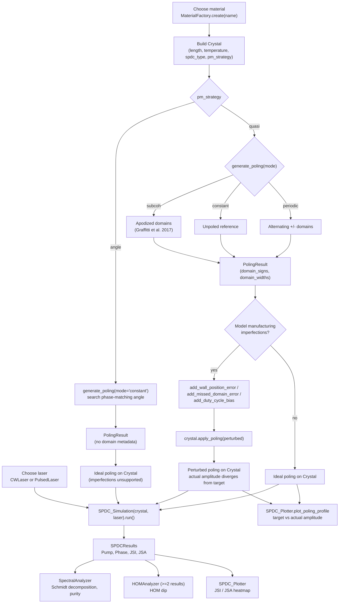

# PhotonPairLab

[](https://github.com/nicosieber/PhotonPairLab/actions/workflows/tests.yml)

**PhotonPairLab** is a Python toolkit for simulating photon pair generation via spontaneous parametric down-conversion (SPDC) in nonlinear crystals.
It supports both angle phase-matching (APM) and quasi-phase-matching (QPM) using a unified, extensible object-oriented architecture.


---

## Features

- Unified `Crystal` class supporting both QPM and APM via the strategy pattern
- Material data (KTP, BBO, BiBO, ...) loaded by name via `MaterialFactory.create(name)`
- Pluggable phase-matching strategies (`QPMPhaseMatching`, `APMPhaseMatching`), with `Literal`-typed
  parameters for IDE autocomplete on valid `pm_strategy`/`spdc_type`/poling-`mode` values
- QPM poling in periodic, constant, or Gaussian-apodized (`mode="subcoh"`, sub-coherence-length
  domain engineering) form, plus automatic coherence-length calculation
  (`Crystal.ideal_coherence_length`) so the grating always matches the crystal's own dispersion
- Simulation of the joint spectral amplitude/intensity (JSA/JSI), Schmidt decomposition (heralded
  photon purity), and Hong-Ou-Mandel (HOM) interference between one or two sources
- A one-call `simulate_spdc(...)` convenience entry point for the common case, alongside the full
  `Crystal`/`SPDC_Simulation` pipeline for anything more specific
- Manufacturing-imperfection modeling for QPM poling — wall-position error (random-walk or
  bounded), missed domains, and duty-cycle bias — chainable on any `PolingResult` via
  `.add_wall_position_error()`/`.add_missed_domain_error()`/`.add_duty_cycle_bias()` and fed back
  into the crystal with `Crystal.apply_poling(...)` to see the effect on JSA/JSI purity and HOM
  interference
- Easily extensible for new materials and phase-matching types

---

## Installation

Requires Python 3.12+. Clone the repository and install in editable mode:

```sh
git clone https://github.com/nicosieber/PhotonPairLab.git
cd PhotonPairLab
pip install -e .
```

If you use [uv](https://docs.astral.sh/uv/), `uv pip install -e .` does the same.

---

## Usage Example

The quickest path — material, crystal, laser, poling, and simulation in one call, with the crystal's
coherence length computed automatically from its own dispersion:

```python
from photonpairlab import simulate_spdc

results = simulate_spdc(
    material_name="ktp1",       # or "bbo", "bibo", "ktp2", "ktp3"
    crystal_length=30e-3,
    wavelength_pump=775e-9,
    pulse_duration=1.7e-12,
    spdc_type="type-II",
    poling_mode="periodic",     # or "constant", "subcoh"
)
```

For more control — building the crystal and laser yourself, choosing an explicit wavelength grid, or
reusing the same crystal for multiple simulations:

```python
from photonpairlab import Crystal, MaterialFactory, PulsedLaser, SPDC_Simulation, SPDCGridConfig

material = MaterialFactory.create("ktp1")
crystal = Crystal(
    crystal_length=30e-3,
    material=material,
    pm_strategy="quasi",   # or "angle"
    spdc_type="type-II",
    T=30,
)

laser = PulsedLaser(775e-9, pulse_duration=1.7e-12)

# coherence_length wasn't given above, so it's computed automatically here from the crystal's own
# dispersion at these target wavelengths (pass one explicitly to override, e.g. for detuning studies)
crystal.generate_poling(laser=laser, mode="periodic", wavelength_signal=1550e-9, wavelength_idler=1550e-9, resolution=5)

grid = SPDCGridConfig(steps=100, signal_range=(1545e-9, 1560e-9), idler_range=(1545e-9, 1560e-9))
simulation = SPDC_Simulation(crystal, laser, grid=grid)
results = simulation.run()
```

**For a full, worked tutorial** — theory interleaved with code, covering QPM, sub-coherence
apodization, Schmidt purity, HOM interference, temperature tuning, and angle phase-matching/GVM,
with references to the literature — see [`notebooks/demo.ipynb`](notebooks/demo.ipynb).

Modeling a real, imperfectly-fabricated crystal instead of an idealized one:

```python
result = crystal.generate_poling(laser=laser, mode="periodic",
                                  wavelength_signal=1550e-9, wavelength_idler=1550e-9, resolution=5)

# chain any subset of the three fabrication-error mechanisms (Graffitti et al. 2017, Sec. III.3.2)
result = (result
          .add_wall_position_error(method="cumulative", sigma=0.02)
          .add_missed_domain_error(probability=0.01)
          .add_duty_cycle_bias(factor=0.02))

crystal.apply_poling(result)  # recomputes target_amplitude/actual_amplitude for the perturbed pattern
```

See [`notebooks/manufacturing_imperfections.ipynb`](notebooks/manufacturing_imperfections.ipynb)
for the full tutorial on all three mechanisms and their effect on purity and HOM interference.

---

## Running the tests

```sh
python -m pytest
```

Tests are organized by subpackage under `tests/` (`tests_crystal/`, `tests_laser/`, `tests_spdc/`).

---

## Simulation Workflow 

The diagram below shows the actual simulation workflow — from choosing a material through
phase-matching, the optional manufacturing-imperfection step, and on to simulation/analysis — rather
than the package layout.



- **Materials** (`crystal/material/`): properties looked up by name via `MaterialFactory.create(name)`
  from `src/photonpairlab/resources/materials.json`.
- **Phase-matching strategies** (`crystal/phasematching/`): QPM and APM via the strategy pattern;
  manufacturing-imperfection modeling (`imperfections.py`) chains onto QPM `PolingResult`s only, since
  APM's constant poling carries no domain metadata to perturb.
- **Laser** (`laser/`): `CWLaser`/`PulsedLaser` spectral envelope.
- **SPDC** (`spdc/`): simulation (`simulation/`), analysis (`analysis/`), plotting (`plotting.py`).

---

## Extending

- **Add a new material:** Add an entry to `src/photonpairlab/resources/materials.json` and, if needed, a new model class in
  `crystal/material/model/` inheriting from `BaseMaterialModel`, registered in `material_factory.py`'s
  `MODEL_MAPPER`.
- **Add a new phase-matching strategy:** Create a new class in `crystal/phasematching/` inheriting from
  `PhaseMatchingStrategy`, and register it in `crystal.py`'s `PM_STRATEGY_HANDLER`.
- **Use your new classes** by passing them to the `Crystal` constructor.

---

## License

MIT

---

## Acknowledgments

PhotonPairLab is inspired by the needs of quantum optics research and is open for contributions and extensions.

---

## Demo

**For a full walkthrough with theory and worked examples, see [`notebooks/demo.ipynb`](notebooks/demo.ipynb).**

**For manufacturing-imperfection modeling specifically, see
[`notebooks/manufacturing_imperfections.ipynb`](notebooks/manufacturing_imperfections.ipynb).**

---

## Getting in contact
If you want to reach out to me, you can do so by contacting me on [LinkedIn](https://www.linkedin.com/in/nico-sieber-0a7204156/).
