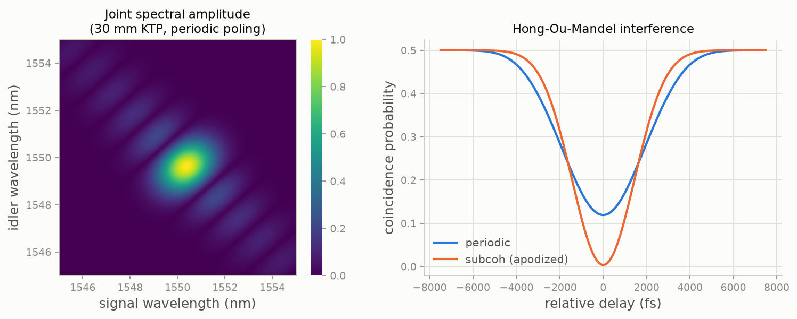

# PhotonPairLab

[](https://github.com/nicosieber/PhotonPairLab/actions/workflows/tests.yml)

**PhotonPairLab** is a Python toolkit for simulating photon pair generation via spontaneous parametric down-conversion (SPDC) in nonlinear crystals.
It supports both angle phase-matching (APM) and quasi-phase-matching (QPM) using a unified, extensible object-oriented architecture.



---

## Features

- Unified `Crystal` class supporting both QPM and APM via the strategy pattern
- Material data (KTP, BBO, BiBO, ...) loaded by name via `MaterialFactory.create(name)`
- Pluggable phase-matching strategies (`QPMPhaseMatching`, `APMPhaseMatching`), with `Literal`-typed
  parameters for IDE autocomplete on valid `pm_strategy`/`spdc_type`/poling-`mode` values
- QPM poling in periodic, constant, or Gaussian-apodized (`mode="subcoh"`, sub-coherence-length
  domain engineering) form, plus automatic coherence-length calculation
  (`Crystal.ideal_coherence_length`) so the grating always matches the crystal's own dispersion
- Simulation of the joint spectral amplitude/intensity (JSA/JSI), Schmidt decomposition (heralded
  photon purity), and Hong-Ou-Mandel (HOM) interference between one or two sources
- A one-call `simulate_spdc(...)` convenience entry point for the common case, alongside the full
  `Crystal`/`SPDC_Simulation` pipeline for anything more specific
- Easily extensible for new materials and phase-matching types

---

## Installation

Requires Python 3.12+. Clone the repository and install in editable mode:

```sh
git clone https://github.com/nicosieber/PhotonPairLab.git
cd PhotonPairLab
pip install -e .
```

If you use [uv](https://docs.astral.sh/uv/), `uv pip install -e .` does the same.

---

## Usage Example

The quickest path — material, crystal, laser, poling, and simulation in one call, with the crystal's
coherence length computed automatically from its own dispersion:

```python
from photonpairlab import simulate_spdc

results = simulate_spdc(
    material_name="ktp1",       # or "bbo", "bibo", "ktp2", "ktp3"
    crystal_length=30e-3,
    wavelength_pump=775e-9,
    pulse_duration=1.7e-12,
    spdc_type="type-II",
    poling_mode="periodic",     # or "constant", "subcoh"
)
```

For more control — building the crystal and laser yourself, choosing an explicit wavelength grid, or
reusing the same crystal for multiple simulations:

```python
from photonpairlab import Crystal, MaterialFactory, PulsedLaser, SPDC_Simulation, SPDCGridConfig

material = MaterialFactory.create("ktp1")
crystal = Crystal(
    crystal_length=30e-3,
    material=material,
    pm_strategy="quasi",   # or "angle"
    spdc_type="type-II",
    T=30,
)

laser = PulsedLaser(775e-9, pulse_duration=1.7e-12)

# coherence_length wasn't given above, so it's computed automatically here from the crystal's own
# dispersion at these target wavelengths (pass one explicitly to override, e.g. for detuning studies)
crystal.generate_poling(laser=laser, mode="periodic", wavelength_signal=1550e-9, wavelength_idler=1550e-9, resolution=5)

grid = SPDCGridConfig(steps=100, signal_range=(1545e-9, 1560e-9), idler_range=(1545e-9, 1560e-9))
simulation = SPDC_Simulation(crystal, laser, grid=grid)
results = simulation.run()
```

**For a full, worked tutorial** — theory interleaved with code, covering QPM, sub-coherence
apodization, Schmidt purity, HOM interference, temperature tuning, and angle phase-matching/GVM,
with references to the literature — see [`notebooks/demo.ipynb`](notebooks/demo.ipynb).

---

## Running the tests

```sh
python -m pytest
```

Tests are organized by subpackage under `tests/` (`tests_crystal/`, `tests_laser/`, `tests_spdc/`).

---

## Documentation

API documentation is built with Sphinx (not currently a declared project dependency, so install it
first):

```sh
pip install sphinx sphinx-book-theme
cd docs
make html
```

Output goes to `docs/build/html`.

---

## Architecture Overview

```
photonpairlab/
│
├── crystal/
│   ├── material/
│   │   ├── base_material.py
│   │   ├── material_factory.py      # MaterialFactory.create("ktp1"/"bbo"/...)
│   │   ├── material_loader.py       # loads src/photonpairlab/resources/materials.json
│   │   └── model/
│   │       ├── base_material_model.py
│   │       ├── general_sellmeier_thermal.py
│   │       ├── kato_takaoka_sellmeier_thermal.py
│   │       ├── sellmeier_linear_thermal.py
│   │       ├── bbo.py
│   │       └── bibo.py
│   ├── phasematching/
│   │   ├── base_pm_strategy.py
│   │   ├── qpm_strategy.py
│   │   ├── apm_strategy.py
│   │   └── pm_result.py
│   ├── crystal.py
│   └── ...
├── laser/
│   ├── base_laser.py
│   ├── cw_laser.py
│   └── pulsed_laser.py
├── spdc/
│   ├── simulation/
│   │   ├── simulation.py            # SPDC_Simulation
│   │   ├── config.py                # SPDCGridConfig/SPDCCenterConfig/SPDCRunConfig (pydantic)
│   │   └── results.py               # SPDCResults
│   ├── analysis/
│   │   ├── spectral_analyser.py     # SpectralAnalyzer (Schmidt decomposition, marginals)
│   │   ├── hom_analyser.py          # HOMAnalyzer
│   │   ├── hom_math.py              # HOM density-matrix math
│   │   ├── fitting.py               # shared curve-fit helpers (gaussian, quadratic, ...)
│   │   └── two_mode_hom_results.py  # TwoModeHOMResults
│   ├── plotting.py                  # SPDC_Plotter
│   └── ...
├── quickstart.py                    # simulate_spdc(...)
└── ...
```

- **Materials:** All nonlinear crystal properties (refractive index, thermal expansion, etc.), looked up
  by name via `MaterialFactory.create(name)`; the underlying data lives in `src/photonpairlab/resources/materials.json`.
- **Phase-Matching Strategies:** QPM and APM logic, interchangeable via the strategy pattern
- **Crystal:** Unified interface, delegates phase-matching to the chosen strategy, and can compute its
  own ideal coherence length (`ideal_coherence_length`) from the material's dispersion
- **SPDC:** Simulation and analysis tools (joint spectral amplitude/intensity, Schmidt decomposition, HOM)

---

## Extending

- **Add a new material:** Add an entry to `src/photonpairlab/resources/materials.json` and, if needed, a new model class in
  `crystal/material/model/` inheriting from `BaseMaterialModel`, registered in `material_factory.py`'s
  `MODEL_MAPPER`.
- **Add a new phase-matching strategy:** Create a new class in `crystal/phasematching/` inheriting from
  `PhaseMatchingStrategy`, and register it in `crystal.py`'s `PM_STRATEGY_HANDLER`.
- **Use your new classes** by passing them to the `Crystal` constructor.

---

## License

MIT

---

## Acknowledgments

PhotonPairLab is inspired by the needs of quantum optics research and is open for contributions and extensions.

---

**For a full walkthrough with theory and worked examples, see [`notebooks/demo.ipynb`](notebooks/demo.ipynb).**

---

## Getting in contact
If you want to reach out to me, you can do so by contacting me on [LinkedIn](https://www.linkedin.com/in/nico-sieber-0a7204156/).
